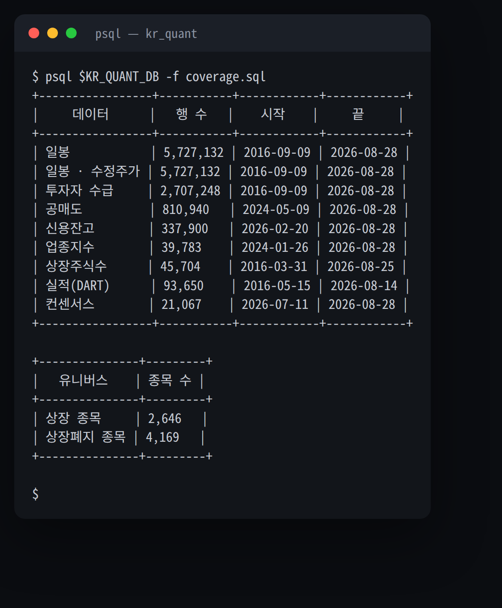

# quant-airflow

[](https://github.com/younghwan91/quant-airflow/actions/workflows/ci.yml)
[](LICENSE)
[](https://www.linkedin.com/in/younghwan-chae/)

퀀트 리서치용 시장 데이터를 매일 자동으로 수집·적재하는 Airflow 파이프라인이다.
**한국 주식**(코스피·코스닥)의 시세·수급·실적·컨센서스를 TimescaleDB 에 쌓고,
**미국 주식**(Sharadar)은 벤더가 주는 벌크 스냅샷으로 DuckDB 스토어를 거래일마다 새로 짓는다.

- **오케스트레이션**: Airflow(LocalExecutor) — 14개 DAG
- **데이터 소스**: DART(실적·공시) · 키움 REST(시세·수급·공매도·신용·상장주식수) · KRX(상장폐지) · 네이버(컨센서스·폐지종목 시세) · Sharadar(미국) · 토스증권(뉴스, krx-news-client)
- **스토어**: TimescaleDB(hypertable + 압축) — LAN 에 열어 메인 PC 가 읽기 전용으로 질의

## 창고에 실제로 뭐가 들어 있나



*2026-08-28 기준 라이브 DB. 질의문은 [`docs/coverage.sql`](docs/coverage.sql).*

## 생존편향을 정면으로 다룬다

**상장 2,646 vs 상장폐지 4,169** 가 이 저장소의 존재 이유다. 대부분의 수집기는 "현재
상장된 종목" 목록 위를 돌고, 그 데이터로 만든 백테스트는 살아남은 회사만 보고 성적을
잰다 — 한국 시장에서 그렇게 빠지는 몫이 **전체의 61%**다. 여기서는 3층으로 메운다.

| 층 | 무엇을 | 어디서 |
|---|---|---|
| 마스터 | 상장폐지 종목 목록 | KRX → `delisted_stocks` |
| 시세 | 폐지 전 과거 일봉 | 네이버 → `daily_bars` (`source='naver'`) |
| 주식수 | 시총 분모(point-in-time) | DART → `shares_outstanding_history` |

행마다 `source` 를 남기는 게 핵심이다. 네이버 폐지분은 거래대금이 근사값이고 수급도
기관·외국인만 온다 — 읽는 쪽이 NULL(모름)과 0(없음)을 구분해야 지표마다 유니버스가
조용히 달라지는 사고를 막는다.

## 아키텍처

데이터가 둘이고 **적재 방식이 서로 다르다.** 한국은 소스 API 가 증분만 주므로 DB 에
직접 upsert 하고, 미국은 벤더가 전체 스냅샷을 주므로 파일을 새로 지어 갈아끼운다.

```
spare PC (Ubuntu, 이 저장소)                                 main PC
┌──────────────────────────────────────────────┐
│ Airflow (LocalExecutor)  dags/*.py            │
│                                                │
│  ── 한국 ────────────────────────────────      │
│   -m collectors.X  ──upsert──►  TimescaleDB   │◄──psql───┐
│                                  (5432, LAN)   │          │
│                                                │     ┌─────────┴──────────┐
│  ── 미국 (Sharadar) ─────────────────────      │     │     분석/백테      │
│   -m collectors.sharadar_bulk                  │     │      kr-quant      │
│        │ bulk zip (modified 바뀐 것만)          │     │ portfolio-research │
│        ▼                                       │     └─────────┬──────────┘
│   sharadar/raw/  ──►  -m collectors.sharadar_build        │
│                            │ build → gate      │          │
│                            ▼ os.replace        │          │
│                       us_micro.duckdb          │◄──file───┘
└──────────────────────────────────────────────┘
```

미국 쪽 화살표가 `os.replace` 인 게 핵심이다 — DuckDB 는 단일 라이터라 직접 upsert 하면
연구와 수집이 상시 서로를 막지만, 파일을 갈아끼우면 연구가 열어둔 중에 배포해도
충돌하지 않는다(기존 리더는 옛 inode 를 계속 읽는다).

스페어 PC 는 24시간 켜 두지 않는다 — cron 이 하루 최대 두 창만 띄우고
`scripts/wait_and_stop.sh` 가 예정된 DAG 가 끝나면 조기 종료한다. 자세한 건
[`docs/operations.md`](docs/operations.md).

## 무엇을 언제 수집하나

**매일 증분 + 주간 깊이 재수집**의 2단 구조다. 평일 DAG 가 최신분을 쌓고, 주간 DAG 가
히스토리 깊이를 유지해 신규 상장·DB 리셋 이후에도 과거가 비지 않게 한다. 모든
수집기가 `(code, date)` upsert 라 idempotent 하다.

| DAG | 스케줄(KST) | 수집 대상 |
|---|---|---|
| `daily_collection` | 평일 16:00 | 일봉 + 수급(키움) + 업종지수 — 쓰는 창 최근 15일 |
| `daily_collection_catchup` | 평일 10:05 | 전날 실패분만 재수집(최신이면 API 호출 0) |
| `daily_short_credit` | 화~토 10:00 | 공매도 + 신용잔고(키움, T+1~2 지연) — 쓰는 창 최근 10일 |
| `daily_earnings` | 평일 16:00 | DART 실적 증분(당기 + 전분기) |
| `daily_price_adjust` | 평일 16:55 | `daily_bars_adjusted` 재생성 |
| `daily_consensus` | 평일 17:00 | 네이버 컨센서스(월요일만 전종목) |
| `daily_sharadar` | 화~토 17:30 | 미국 벌크 스냅샷 → 스토어 재구축 → 검증 → 원자적 공개 |
| `daily_news` | 평일 10:05 · 16:05 | 토스증권 뉴스 + DART 공시([krx-news-client](https://github.com/younghwan91/krx-news-client)) — 백테스팅+실매매용 |
| `earnings_backfill` | 일 10:00 | DART 실적 전체 이력 백필(resume) |
| `weekly_history_backfill` | 일 11:00 | 업종지수·공매도·신용 히스토리 깊이 재수집 |
| `weekly_listed_shares` | 화 10:10 | 키움 상장주식수 스냅샷 |
| `weekly_delisted_stocks` | 토 10:05 | 폐지 마스터 + 과거 일봉 + 상장주식수 백필(위 3층) |
| `weekly_price_adjust` | 토 10:40 | 폐지 시세 백필 **완료를 센서로 확인한 뒤** 조정가 재생성 |
| `monthly_listed_shares_backfill` | 매월 1일 10:20 | 2016~2025 상장주식수 백필 — 정상 상태에선 대상 0 |
| `daily_krx_shares` | 수동 전용 | ⛔ KRX 가 로그인을 걸어 `schedule=None` — `weekly_listed_shares` + `dart_shares` 로 대체 |

외부 API 태스크는 `retries=1, 10분`, 전체 이력 백필은 `retries=2, 30분` 이다.
신용잔고는 키움 API 가 최근 100 거래일까지만 준다 — 그보다 깊이는 채울 수 없다.

## 빠른 시작

```bash
git clone <this-repo> quant-airflow
git clone https://github.com/younghwan91/kr-quant.git ../kr-quant   # sibling — 두 DAG만 사용
cd quant-airflow

cp .env.example .env   # KIWOOM_*, DART_API_KEY(_2/_3), TIMESCALE_*, AIRFLOW_* 채우기
docker compose up -d                 # 스케줄러 + Airflow 메타DB + TimescaleDB
docker compose --profile ui up -d    # 웹 UI(`http://<spare-pc-ip>:8080`)가 필요할 때만
```

TimescaleDB 는 `<spare-pc-ip>:5432` 로 LAN 에 열려 있고 메인 PC 가 여기에 질의한다.

## 데이터 읽는 법

```python
import pandas as pd, psycopg2
conn = psycopg2.connect(host="<spare-pc-ip>", port=5432,
                        dbname="kr_quant", user="kr_quant", password="...")
df = pd.read_sql("SELECT * FROM daily_bars_adjusted WHERE code = %s ORDER BY date",
                 conn, params=("005930",))
```

분석·백테스트 코드는 [kr-quant](https://github.com/younghwan91/kr-quant) 에 있으며 이
DB 를 읽기 전용으로 쓴다.

더 자세히 — [`docs/schema.md`](docs/schema.md) 테이블·압축 설계·마이그레이션 ·
[`docs/operations.md`](docs/operations.md) 가동 창·시크릿·저장소 구조 ·
[`docs/sharadar.md`](docs/sharadar.md) 미국 파이프라인. 라이선스는 [MIT](LICENSE).

---

## ⭐ 도움이 되셨다면

이 프로젝트가 유용했다면 우측 상단 **[⭐ Star](https://github.com/younghwan91/quant-airflow)** 를 눌러주세요. 검색·추천 노출이 올라가 더 많은 분들이 찾을 수 있습니다.

- 🐛 버그·질문 → [Issues](https://github.com/younghwan91/quant-airflow/issues)
- 📈 업데이트 소식 → [팔로우 @younghwan91](https://github.com/younghwan91)

## 관련 프로젝트 — 오픈소스 퀀트 스택

한국·미국 주식과 암호화폐를 아우르는 오픈소스 스택입니다. 각 저장소는 독립적으로 쓸 수 있습니다.

| 축 | 프로젝트 | 설명 |
|---|---|---|
| 🇰🇷 한국 주식 | **[kiwoom-client](https://github.com/younghwan91/kiwoom-client)** | 키움증권 REST API Python 라이브러리 — 국내주식 엔드포인트 전수·실시간 WebSocket, sync + async (`pip install kiwoom-client`) |
| 🇰🇷 한국 주식 | **[krx-fundamentals-client](https://github.com/younghwan91/krx-fundamentals-client)** | 국내 기업 펀더멘탈 Python 클라이언트 라이브러리 — 재무제표·투자지표·배당·종목 스크리닝 (DART + KRX + 네이버) |
| 🇰🇷 한국 주식 | **[krx-news-client](https://github.com/younghwan91/krx-news-client)** | 한국 주식 뉴스·공시 수집 Python 클라이언트 라이브러리 (DART + 토스) |
| 🇰🇷 한국 주식 | **[fin-checkup](https://github.com/younghwan91/fin-checkup)** | 관심종목 위험 공시 텔레그램 알림 + DART·SEC 재무 건강검진 — 측정값과 사실만 전달한다 |
| 🇰🇷 한국 주식 | **[kr-quant](https://github.com/younghwan91/kr-quant)** | 코스피·코스닥 알파 리서치 — walk-forward·랜덤 음성대조·purged CV·Deflated Sharpe 를 CI 가드레일로 강제 |
| 🇺🇸 미국 주식 | **[portfolio-research](https://github.com/younghwan91/portfolio-research)** | 미국주식 팩터 엔진 — point-in-time·생존편향 보정 데이터 위에서 walk-forward 를 Deflated Sharpe·PBO 로 게이팅 (+ ETF 전술배분 TAA — 9개 사전등록, 채택 0) |
| 🇺🇸 미국 주식 | **[automated-stock-trading-systems](https://github.com/younghwan91/automated-stock-trading-systems)** | Bensdorp 의 7개 비상관 트레이딩 시스템 백테스터 (교육용 재구현) |
| ₿ 암호화폐 | **[quantbox-engine](https://github.com/younghwan91/quantbox-engine)** | 암호화폐 선물 백테스트·실행 엔진 — 룩어헤드 0, 백테스트↔실거래 일체화 |

## 만든 사람

**채영환 (Younghwan Chae)** · [GitHub @younghwan91](https://github.com/younghwan91) · [LinkedIn](https://www.linkedin.com/in/younghwan-chae/)

전체 오픈소스 퀀트 스택은 [프로필](https://github.com/younghwan91)에서 한눈에 볼 수 있습니다.
