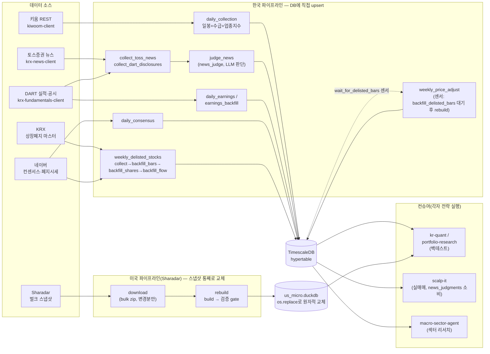

# quant-airflow

[](https://github.com/younghwan91/quant-airflow/actions/workflows/ci.yml)
[](LICENSE)
[](https://www.linkedin.com/in/younghwan-chae/)

퀀트 리서치용 시장 데이터를 매일 자동으로 수집·적재하는 Airflow 파이프라인이다.
**한국 주식**(코스피·코스닥)의 시세·수급·실적·컨센서스를 TimescaleDB 에 쌓고,
**미국 주식**(Sharadar)은 벤더가 주는 벌크 스냅샷으로 DuckDB 스토어를 거래일마다 새로 짓는다.

- **오케스트레이션**: Airflow(LocalExecutor) — 16개 DAG
- **데이터 소스**: DART(실적·공시) · 키움 REST(시세·수급·공매도·신용·상장주식수) · KRX(상장폐지) · 네이버(컨센서스·폐지종목 시세) · Sharadar(미국) · 토스증권(뉴스, krx-news-client)
- **스토어**: TimescaleDB(hypertable + 압축) — LAN 에 열어 메인 PC 가 읽기 전용으로 질의

## 두 호스트로 나뉜 배치 (2026-09-11)

Airflow 와 TimescaleDB 는 이제 **같은 스택이 아니다.** DB 는 24/7 상시(이 문서에서
"DB 호스트"), Airflow(스케줄러·웹서버·메타DB)는 자원이 넉넉한 별도 호스트("Airflow
호스트")에서 역시 24/7 상시로 돈다. 예전엔 하나였던 걸 하루 4번 껐다 켰다 했는데
(`docs/operations.md` 의 옛 "가동 창" 참고), Airflow 호스트가 상시 구동을 버틸
만큼 여유로우면 그 창 자체가 필요 없다.

> **DB 호스트는 고정된 물리적 위치가 아니다 — PRIMARY 인 쪽이 DB 호스트다.**
> 최초 분리(2026-09-11 오전)는 실시간 틱 수집기(scalp-it)와 물리적으로 같은
> 호스트에 PRIMARY 를 두는 설계였다(순단 재연결 실패 회피). 같은 날 저녁,
> collector 에 재연결+디스크 스풀이 들어가 LAN 순단을 스스로 버티는 게 실전
> 검증되면서 PRIMARY 를 자원이 넉넉한 호스트로 승격(`pg_promote()`)했다 — 수집기는
> 원래 호스트에 그대로 두고, LAN 너머 새 PRIMARY 에 쓴다. 옛 PRIMARY 는 새
> PRIMARY 의 리플리카로 재구성했다(`docker-compose.timescale.yml` — 파일 이름은
> 안 바꿨지만 내용이 role 을 명시한다). **어느 쪽이 지금 PRIMARY 인지는 코드가
> 아니라 상태다** — `pg_is_in_recovery()` 로 확인한다(false = PRIMARY).

```bash
git clone <this-repo> quant-airflow
git clone https://github.com/younghwan91/kr-quant.git ../kr-quant   # sibling
git clone https://github.com/younghwan91/portfolio-research.git ../portfolio-research  # sibling
cd quant-airflow
cp .env.example .env   # 아래 필수값 채우기
```

**DB 호스트**에서 (지금 PRIMARY 를 맡을 호스트 — 위 안내 상자 참고. `pg_is_in_recovery()`
가 false 로 나와야 PRIMARY):

```bash
docker compose -f docker-compose.timescale.yml up -d
```

**Airflow 호스트**에서 (DB 호스트와 LAN 으로 연결, `.env` 의 `TIMESCALE_HOST` 를
DB 호스트의 LAN IP 로 설정):

```bash
docker compose -f docker-compose.airflow.yml up -d
```

한 대에서 둘 다 테스트하고 싶으면(`TIMESCALE_HOST` 기본값이 도커 네트워크
서비스명 `timescaledb` 라 그대로 붙는다):

```bash
docker compose -f docker-compose.timescale.yml -f docker-compose.airflow.yml up -d
```

`.env` 에 채워야 하는 값:

| 변수 | 용도 |
|---|---|
| `KIWOOM_APP_KEY` / `KIWOOM_APP_SECRET` | 키움 REST — 시세·수급·공매도·신용·상장주식수 |
| `DART_API_KEY`(`_2`/`_3`) | DART OpenAPI — [무료 발급](https://opendart.fss.or.kr), 보조키를 추가하면 일한도가 키 개수만큼 늘어난다 |
| `TIMESCALE_*` / `AIRFLOW_*` | DB 접속 정보·Airflow 시크릿(`.env.example` 에 생성법 주석 포함). Airflow 호스트에서는 `TIMESCALE_HOST` 를 DB 호스트 LAN IP 로 override |
| `US_DATA_DIR` | Sharadar DuckDB 스토어(`us_micro.duckdb`)가 있는 호스트 디렉터리 — Airflow 호스트 쪽에 있어야 한다. 없으면 `daily_sharadar` 가 돌지 않는다 |

TimescaleDB 는 지금 PRIMARY 인 호스트에서 LAN 에 열려 있고 메인 PC 와 Airflow
호스트 양쪽이 여기에 질의한다. 포트는 호스트마다 다를 수 있다(트래픽 정리 편의상
바꾸지 않고 그대로 둠) — 실제 값은 `kr-quant/.env` 의 `KR_QUANT_DB`, 이
레포 `.env` 의 `TIMESCALE_HOST`/`TIMESCALE_PORT` 를 확인한다.

**scalp-it(실시간 틱 수집기) 쪽은 이 레포를 통째로 clone 하지 않는다** — 필요한 건
`docker-compose.timescale.yml`(리플리카 기동)뿐이라 `git sparse-checkout set`으로 그
파일만 받는다. 전체 레포(DAG·수집기 등)는 항상 Airflow 호스트 쪽 clone 이 정본이다 —
같은 레포가 양쪽 호스트에 있다고 양쪽 다 "찐"인 게 아니라는 점에 주의(구성 파일
수정은 Airflow 호스트에서 하고 push, scalp-it 쪽은 pull 만).

**구글 드라이브 백업(`scripts/backup_to_gdrive.sh`)은 Airflow 호스트에서만 돈다.**
2026-09-13 에 scalp-it 호스트의 19:00 크론을 지웠다 — 양쪽이 같은 시각에 돌고 있었고
스크립트가 날짜 기반 파일명(`core/core-<날짜>.sql.gz`, `sharadar/duckdb/<날짜>/`)을
쓰기 때문에 나중에 끝난 쪽이 먼저 끝난 쪽을 덮어썼다. 09-11 이후 DB PRIMARY 와
`daily_sharadar` 산출물이 모두 Airflow 호스트에 있으므로, scalp-it 쪽에서 돌면 낡은
스탠바이 덤프와 낡은 미국 데이터가 그날 파일이 된다.

**리플리카가 WAL 스트리밍 끊김으로 죽으면** (`could not receive data from WAL stream:
requested WAL segment ... has already been removed` — `max_slot_wal_keep_size` 한도를
넘겨 리플리카가 못 따라잡은 경우, 증분 복구 불가) `docker-compose.replica.yml` 파일
헤더 주석에 재시딩(`pg_basebackup -R -C -S <slot>`) 절차가 적혀 있다.

## 데이터 읽는 법

```python
import pandas as pd, psycopg2
conn = psycopg2.connect(host="<spare-pc-ip>", port=5432,
                        dbname="kr_quant", user="kr_quant", password="...")
df = pd.read_sql("SELECT * FROM daily_bars_adjusted WHERE code = %s ORDER BY date",
                 conn, params=("005930",))
```

분석·백테스트 코드는 [kr-quant](https://github.com/younghwan91/kr-quant) 에 있으며 이
DB 를 읽기 전용으로 쓴다.

## 창고에 실제로 뭐가 들어 있나


*2026-08-28 기준 라이브 DB. 질의문은 [`docs/coverage.sql`](docs/coverage.sql).*

## 생존편향을 정면으로 다룬다

**상장 2,646 vs 상장폐지 4,169** 가 이 저장소의 존재 이유다. 대부분의 수집기는 "현재
상장된 종목" 목록 위를 돌고, 그 데이터로 만든 백테스트는 살아남은 회사만 보고 성적을
잰다 — 한국 시장에서 그렇게 빠지는 몫이 **전체의 61%**다. 여기서는 3층으로 메운다.

| 층 | 무엇을 | 어디서 |
|---|---|---|
| 마스터 | 상장폐지 종목 목록 | KRX → `delisted_stocks` |
| 시세 | 폐지 전 과거 일봉 | 네이버 → `daily_bars` (`source='naver'`) |
| 주식수 | 시총 분모(point-in-time) | DART → `shares_outstanding_history` |

행마다 `source` 를 남기는 게 핵심이다. 네이버 폐지분은 거래대금이 근사값이고 수급도
기관·외국인만 온다 — 읽는 쪽이 NULL(모름)과 0(없음)을 구분해야 지표마다 유니버스가
조용히 달라지는 사고를 막는다.

## 아키텍처

데이터가 둘이고 **적재 방식이 서로 다르다.** 한국은 소스 API 가 증분만 주므로 DB 에
직접 upsert 하고, 미국은 벤더가 전체 스냅샷을 주므로 파일을 새로 지어 갈아끼운다.
아래는 실제 `dags/*.py` 의 태스크 의존성(`>>`)을 그대로 옮긴 것이다.



이 저장소는 그 자체로 전략을 짜지 않는다 — 위 컨슈머들(`kr-quant`/`portfolio-research`
의 백테스트, `scalp-it`의 실매매, `macro-sector-agent`의 섹터 리서치)이 각자 전략을
돌릴 수 있게 **믿을 수 있는 point-in-time 데이터를 공급하는 인프라**가 이 레포의
역할이다. 가동 스케줄·시크릿 등 운영 디테일은 [`docs/operations.md`](docs/operations.md).

## 무엇을 언제 수집하나

**매일 증분 + 주간 깊이 재수집**의 2단 구조다. 평일 DAG 가 최신분을 쌓고, 주간 DAG 가
히스토리 깊이를 유지해 신규 상장·DB 리셋 이후에도 과거가 비지 않게 한다. 모든
수집기가 `(code, date)` upsert 라 idempotent 하다.

| DAG | 스케줄(KST) | 수집 대상 |
|---|---|---|
| `daily_collection` | 평일 16:00 | 일봉 + 수급(키움) + 업종지수 |
| `daily_collection_catchup` | 평일 10:05 | 전날 실패분만 재수집 |
| `daily_short_credit` | 화~토 10:00 | 공매도 + 신용잔고(키움) |
| `daily_earnings` | 평일 16:00 | DART 실적 증분(당기 + 전분기) |
| `daily_price_adjust` | 평일 16:55 | `daily_bars_adjusted` 재생성 |
| `daily_consensus` | 평일 17:00 | 네이버 컨센서스(월요일만 전종목) |
| `daily_sharadar` | 화~토 17:30 | 미국 벌크 스냅샷 → 재구축 → 검증 → 공개 |
| `daily_news` | 평일 10:05 · 16:05 | 토스·DART 뉴스/공시 수집 + LLM 판단(news_judgments) |
| `premarket_news_judgment` | 평일 08:45 | daily_news와 동일 수집 — 개장 전 시가 진입 판단용 |
| `earnings_backfill` | 일 10:00 | DART 실적 전체 이력 백필 |
| `weekly_history_backfill` | 일 11:00 | 업종지수·공매도·신용 히스토리 깊이 재수집 |
| `monthly_listed_shares_backfill` | 매월 1일 10:20 | DART 상장주식수 과거 백필(2016~2025, 생존편향 3층 중 "주식수"를 채우는 실제 DAG) |
| `weekly_listed_shares` | 화 10:10 | 키움 상장주식수 스냅샷(2026년 이후분, 과거 백필 불가) |
| `weekly_delisted_stocks` | 토 10:05 | 폐지 마스터 + 과거 일봉 + 상장주식수 백필(위 3층) |
| `weekly_price_adjust` | 토 10:40 | 폐지 시세 백필 후 조정가 재생성 |

나머지 DAG(`daily_krx_shares` — KRX 소스가 로그인 벽으로 막혀 현재 paused, 수동 트리거 전용 등)는 `dags/` 코드 참고.

## 더 자세히

- [`docs/schema.md`](docs/schema.md) — 테이블·압축 설계·마이그레이션
- [`docs/operations.md`](docs/operations.md) — 가동 창·시크릿·저장소 구조
- [`docs/sharadar.md`](docs/sharadar.md) — 미국 파이프라인

라이선스는 [MIT](LICENSE).

---

버그·질문은 [Issues](https://github.com/younghwan91/quant-airflow/issues)로.

## 관련 프로젝트

이 파이프라인이 직접 쓰거나(클라이언트 라이브러리) 소비하는(컨슈머) 저장소.

| 프로젝트 | 관계 |
|---|---|
| **[kiwoom-client](https://github.com/younghwan91/kiwoom-client)** | 키움증권 REST API 클라이언트 — 시세·수급 수집에 사용 (`pip install kiwoom-client`) |
| **[krx-fundamentals-client](https://github.com/younghwan91/krx-fundamentals-client)** | DART·KRX·네이버 펀더멘탈 클라이언트 — 실적 수집에 사용 |
| **[krx-news-client](https://github.com/younghwan91/krx-news-client)** | DART·토스 뉴스/공시 클라이언트 — 뉴스 수집에 사용 |
| **[kr-quant](https://github.com/younghwan91/kr-quant)** | 이 저장소의 TimescaleDB 를 읽어 코스피·코스닥 알파를 리서치 |
| **[portfolio-research](https://github.com/younghwan91/portfolio-research)** | 이 저장소의 Sharadar/DuckDB 스토어를 읽어 미국주식 팩터를 리서치 |

전체 오픈소스 퀀트 스택은 [프로필](https://github.com/younghwan91)에서 볼 수 있습니다.

## 만든 사람

**채영환 (Younghwan Chae)** · [GitHub @younghwan91](https://github.com/younghwan91) · [LinkedIn](https://www.linkedin.com/in/younghwan-chae/)
