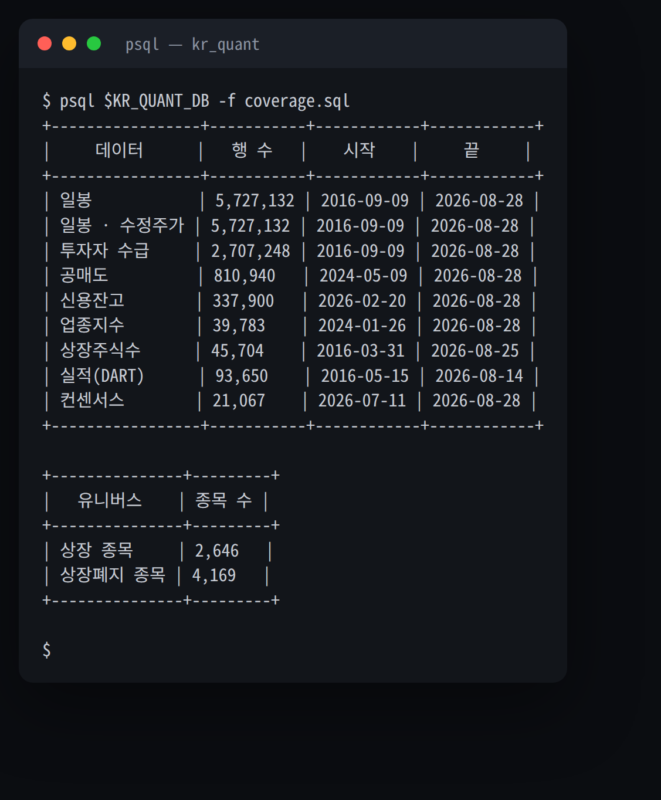
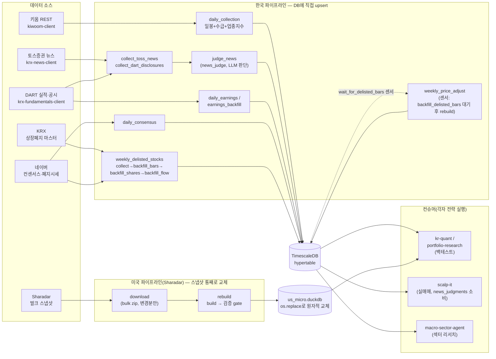

# quant-airflow

[](https://github.com/younghwan91/quant-airflow/actions/workflows/ci.yml)
[](LICENSE)
[](https://www.linkedin.com/in/younghwan-chae/)

퀀트 리서치용 시장 데이터를 매일 자동으로 수집·적재하는 Airflow 파이프라인이다.
**한국 주식**(코스피·코스닥)의 시세·수급·실적·컨센서스를 TimescaleDB 에 쌓고,
**미국 주식**(Sharadar)은 벤더가 주는 벌크 스냅샷으로 DuckDB 스토어를 거래일마다 새로 짓는다.

- **오케스트레이션**: Airflow(LocalExecutor) — 17개 DAG
- **데이터 소스**: DART(실적·공시) · 키움 REST(시세·수급·공매도·신용·상장주식수) · KRX(상장폐지) · 네이버(컨센서스·폐지종목 시세) · Sharadar(미국) · 토스증권(뉴스, krx-news-client)
- **스토어**: TimescaleDB(hypertable + 압축) — LAN 에 열어 메인 PC 가 읽기 전용으로 질의

## 배치 — 한 호스트, 24/7 (2026-10-07~)

Airflow(스케줄러·웹서버·메타DB)와 TimescaleDB 는 **같은 호스트(simnode)에서 서로 다른
compose 스택으로** 상시 돈다 — 한쪽을 내리고 올려도 다른 쪽이 안 흔들린다. 같은 호스트에서
다른 레포의 장중 라이브(scalp-it 틱 수집·감지기, daytrade-it 뉴스 데몬)도 돈다. 하루 4번
껐다 켜던 옛 "가동 창"과 2026-09-11 ~ 10-06 의 두 호스트 시절(PRIMARY + trader 리플리카)
경위는 [`docs/operations.md`](docs/operations.md) 에 있다.

| compose 파일 | 내용 |
|---|---|
| `docker-compose.replica.yml` | TimescaleDB **PRIMARY**(:5433). 이름만 replica — 2026-09-11 `pg_promote()` 로 역할이 바뀌었고 볼륨·포트가 여러 DSN 에 박혀 있어 이름은 안 바꿨다. 역할은 `SELECT pg_is_in_recovery();`(false = PRIMARY)로 확인 |
| `docker-compose.airflow.yml` | Airflow 4종. DB 는 이 파일에 없다 — `.env` 의 `TIMESCALE_HOST`/`TIMESCALE_PORT` 로 위 PRIMARY 에 붙는다 |
| `docker-compose.timescale.yml` | 폐기된 trader 리플리카의 참고본. 지금 아무 데서도 띄우지 않는다 |

**DB 사본은 하나다** — 리플리카가 없어 두 번째 사본은 구글 드라이브 백업
(`scripts/backup_to_gdrive.sh`, 이 호스트에서만 돈다)뿐이다.

```bash
git clone <this-repo> quant-airflow
git clone https://github.com/younghwan91/swing-it.git ../swing-it                       # sibling
git clone https://github.com/younghwan91/portfolio-research.git ../portfolio-research  # sibling
cd quant-airflow
cp .env.example .env   # 아래 필수값 채우기

docker compose -f docker-compose.replica.yml up -d   # DB(PRIMARY) — 볼륨은 external 이다
docker compose -f docker-compose.airflow.yml up -d   # Airflow
```

위 DB 줄은 **이미 데이터가 든 볼륨**을 띄우는 것이다. `docker-compose.replica.yml` 은 볼륨이
`external` 이고 `POSTGRES_USER/PASSWORD/DB` 가 없어 빈 볼륨에서 initdb 를 하지 못한다 — 새
머신에 처음 세울 때는 `docker-compose.timescale.yml`(그 환경변수와 `sql/init_timescale.sql`
마운트가 있다)을 참고하거나 구글 드라이브 백업에서 복원한다. 스키마의 정본은
`sql/init_timescale.sql` + `sql/migrations/*.sql` 이다.

`.env` 에 채워야 하는 값:

| 변수 | 용도 |
|---|---|
| `KIWOOM_APP_KEY` / `KIWOOM_APP_SECRET` | 키움 REST — 시세·수급·공매도·신용·상장주식수 |
| `DART_API_KEY`(`_2`/`_3`) | DART OpenAPI — [무료 발급](https://opendart.fss.or.kr), 보조키를 추가하면 일한도가 키 개수만큼 늘어난다 |
| `TIMESCALE_*` / `AIRFLOW_*` | DB 접속 정보·Airflow 시크릿(`.env.example` 에 생성법 주석 포함). `TIMESCALE_HOST` 는 호스트 LAN IP, `TIMESCALE_PORT=5433` |
| `US_DATA_DIR` | Sharadar DuckDB 스토어(`us_micro.duckdb`) 디렉터리. 없으면 `daily_sharadar` 가 돌지 않는다 |

TimescaleDB 는 LAN 에 열려 있어 다른 PC 도 읽기 전용으로 질의한다. 실제 접속값은 이 레포
`.env` 의 `KR_QUANT_DB`·`TIMESCALE_HOST`/`TIMESCALE_PORT` 를 본다 — 같은 호스트의 다른
레포(scalp-it·daytrade-it 크론)도 이 파일에서 DSN 을 읽는다.

<details>
<summary>수집기를 다른 호스트로 떼어낼 때 (2026-09-11 ~ 10-06 의 trader 구성)</summary>

그 호스트는 이 레포를 통째로 clone 하지 않고 리플리카용 compose·스키마와 알림 전송기만
sparse 로 받았다:

```bash
git sparse-checkout set --no-cone /docker-compose.timescale.yml /sql/init_timescale.sql \
  /scripts/alert.sh /scripts/cron_run.sh /collectors/alert.py /collectors/config.py /collectors/__init__.py
```

전체 레포는 항상 Airflow 호스트 쪽 clone 이 정본이다. sparse 체크아웃에서 만든 워크트리는
그 패턴을 물려받으므로 거기서 테스트하려면 `git sparse-checkout disable` 한다. 백업은 그쪽에서
돌리지 않는다 — 날짜 기반 파일명이라 낡은 스탠바이 덤프가 그날 파일을 덮어쓴다(2026-09-13 사고).
리플리카가 WAL 스트리밍 끊김(`requested WAL segment ... has already been removed`)으로 죽었을
때의 재시딩(`pg_basebackup -R -C -S <slot>`) 절차는 `docker-compose.replica.yml` 헤더에 있다.

</details>

## 데이터 읽는 법

```python
import pandas as pd, psycopg2
conn = psycopg2.connect(host="<db-host-ip>", port=5433,
                        dbname="kr_quant", user="kr_quant", password="...")
df = pd.read_sql("SELECT * FROM daily_bars_adjusted WHERE code = %s ORDER BY date",
                 conn, params=("005930",))
```

분석·백테스트 코드는 [swing-it](https://github.com/younghwan91/swing-it)(구 kr-quant) 에 있으며 이
DB 를 읽기 전용으로 쓴다.

## 창고에 실제로 뭐가 들어 있나



*2026-08-28 기준 라이브 DB. 질의문은 [`docs/coverage.sql`](docs/coverage.sql).*

## 생존편향을 정면으로 다룬다

**상장 2,646 vs 상장폐지 4,169** 가 이 저장소의 존재 이유다. 대부분의 수집기는 "현재
상장된 종목" 목록 위를 돌고, 그 데이터로 만든 백테스트는 살아남은 회사만 보고 성적을
잰다 — 한국 시장에서 그렇게 빠지는 몫이 **전체의 61%**다. 여기서는 3층으로 메운다.

| 층 | 무엇을 | 어디서 |
|---|---|---|
| 마스터 | 상장폐지 종목 목록 | KRX → `delisted_stocks` |
| 시세 | 폐지 전 과거 일봉 | 네이버 → `daily_bars` (`source='naver'`) |
| 주식수 | 시총 분모(point-in-time) | DART → `shares_outstanding_history` |

행마다 `source` 를 남기는 게 핵심이다. 네이버 폐지분은 거래대금이 근사값이고 수급도
기관·외국인만 온다 — 읽는 쪽이 NULL(모름)과 0(없음)을 구분해야 지표마다 유니버스가
조용히 달라지는 사고를 막는다.

## 아키텍처

데이터가 둘이고 **적재 방식이 서로 다르다.** 한국은 소스 API 가 증분만 주므로 DB 에
직접 upsert 하고, 미국은 벤더가 전체 스냅샷을 주므로 파일을 새로 지어 갈아끼운다.
아래는 실제 `dags/*.py` 의 태스크 의존성(`>>`)을 그대로 옮긴 것이다.


```mermaid
flowchart LR
    subgraph SRC["데이터 소스"]
        KIWOOM["키움 REST<br/>kiwoom-client"]
        DART["DART 실적·공시<br/>krx-fundamentals-client"]
        KRXM["KRX<br/>상장폐지 마스터"]
        NAVER["네이버<br/>컨센서스·폐지시세"]
        TOSS["토스증권 뉴스<br/>krx-news-client"]
        SHARADAR["Sharadar<br/>벌크 스냅샷"]
    end

    subgraph KR["한국 파이프라인 — DB에 직접 upsert"]
        COL["daily_collection<br/>일봉+수급+업종지수"]
        NEWSCOL["collect_toss_news<br/>collect_dart_disclosures"]
        JUDGE["judge_news<br/>(news_judge, LLM 판단)"]
        EARN["daily_earnings /<br/>earnings_backfill"]
        CONS["daily_consensus"]
        DELIST["weekly_delisted_stocks<br/>collect→backfill_bars→<br/>backfill_shares→backfill_flow"]
        ADJ["weekly_price_adjust<br/>(센서: backfill_delisted_bars 대기 후 rebuild)"]
    end

    subgraph US["미국 파이프라인(Sharadar) — 스냅샷 통째로 교체"]
        DL["download<br/>(bulk zip, 변경분만)"]
        BUILD["rebuild<br/>build → 검증 gate"]
    end

    TS[("TimescaleDB<br/>hypertable")]
    DUCK[("us_micro.duckdb<br/>os.replace로 원자적 교체")]

    KIWOOM --> COL --> TS
    TOSS --> NEWSCOL
    DART --> NEWSCOL
    NEWSCOL --> JUDGE --> TS
    DART --> EARN --> TS
    NAVER --> CONS --> TS
    KRXM --> DELIST
    NAVER --> DELIST
    DELIST --> TS
    TS -. "wait_for_delisted_bars 센서" .-> ADJ --> TS
    SHARADAR --> DL --> BUILD --> DUCK

    subgraph CONSUMER["컨슈머(각자 전략 실행)"]
        KRQ["kr-quant /<br/>portfolio-research<br/>(백테스트)"]
        SCALP["scalp-it<br/>(실매매, news_judgments 소비)"]
        MACRO["macro-sector-agent<br/>(섹터 리서치)"]
    end

    TS --> KRQ & SCALP & MACRO
    DUCK --> KRQ
```

이 저장소는 그 자체로 전략을 짜지 않는다 — 위 컨슈머들(`kr-quant`/`portfolio-research`
의 백테스트, `scalp-it`의 실매매, `macro-sector-agent`의 섹터 리서치)이 각자 전략을
돌릴 수 있게 **믿을 수 있는 point-in-time 데이터를 공급하는 인프라**가 이 레포의
역할이다. 가동 스케줄·시크릿 등 운영 디테일은 [`docs/operations.md`](docs/operations.md).

## 무엇을 언제 수집하나

**매일 증분 + 주간 깊이 재수집**의 2단 구조다. 평일 DAG 가 최신분을 쌓고, 주간 DAG 가
히스토리 깊이를 유지해 신규 상장·DB 리셋 이후에도 과거가 비지 않게 한다. 모든
수집기가 `(code, date)` upsert 라 idempotent 하다.

| DAG | 스케줄(KST) | 수집 대상 |
|---|---|---|
| `daily_collection` | 평일 16:00 | 일봉 + 수급(키움) + 업종지수 |
| `daily_collection_catchup` | 평일 10:05 | 전날 실패분만 재수집 |
| `daily_short_credit` | 화~토 10:00 | 공매도 + 신용잔고(키움) |
| `daily_earnings` | 평일 16:00 | DART 실적 증분(당기 + 전분기) |
| `daily_price_adjust` | 평일 16:55 | `daily_bars_adjusted` 재생성 |
| `daily_finalize` | 화~토 06:30 | 전 거래일 일봉·수급·업종지수를 **확정치로 재수집**(16:00 값은 잠정) → 조정주가 재생성 |
| `daily_consensus` | 평일 17:00 | 네이버 컨센서스(월요일만 전종목) |
| `daily_sharadar` | 화~토 17:30 | 미국 벌크 스냅샷 → 재구축 → 검증 → 공개 |
| `daily_news` | 평일 10:05 · 16:05 | 토스·DART 뉴스/공시 수집 + LLM 판단(news_judgments) |
| `premarket_news_judgment` | 평일 08:45 | daily_news와 동일 수집 — 개장 전 시가 진입 판단용 |
| `earnings_backfill` | 일 10:00 | DART 실적 전체 이력 백필 |
| `weekly_history_backfill` | 일 11:00 | 업종지수·공매도·신용 히스토리 깊이 재수집 |
| `monthly_listed_shares_backfill` | 매월 1일 10:20 | DART 상장주식수 과거 백필(2016~2025, 생존편향 3층 중 "주식수"를 채우는 실제 DAG) |
| `weekly_listed_shares` | 화 10:10 | 키움 상장주식수 스냅샷(2026년 이후분, 과거 백필 불가) |
| `weekly_delisted_stocks` | 토 10:05 | 폐지 마스터 + 과거 일봉 + 상장주식수 백필(위 3층) |
| `weekly_price_adjust` | 토 10:40 | 폐지 시세 백필 후 조정가 재생성 |

나머지 DAG(`daily_krx_shares` — KRX 소스가 로그인 벽으로 막혀 현재 paused, 수동 트리거 전용 등)는 `dags/` 코드 참고.

## 더 자세히

- [`docs/schema.md`](docs/schema.md) — 테이블·압축 설계·마이그레이션
- [`docs/operations.md`](docs/operations.md) — 가동 창·시크릿·저장소 구조
- [`docs/sharadar.md`](docs/sharadar.md) — 미국 파이프라인

라이선스는 [MIT](LICENSE).

---

버그·질문은 [Issues](https://github.com/younghwan91/quant-airflow/issues)로.

## 관련 프로젝트 — 오픈소스 퀀트 스택

한국·미국 주식과 암호화폐를 아우르는 오픈소스 스택입니다. 각 저장소는 독립적으로 쓸 수 있습니다.

| 축 | 프로젝트 | 설명 |
|---|---|---|
| 🇰🇷 한국 주식 | **[kiwoom-client](https://github.com/younghwan91/kiwoom-client)** | 키움증권 REST API Python 라이브러리 — 국내주식 엔드포인트 전수·실시간 WebSocket, sync + async (`pip install kiwoom-client`) |
| 🇰🇷 한국 주식 | **[krx-fundamentals-client](https://github.com/younghwan91/krx-fundamentals-client)** | 국내 기업 펀더멘탈 Python 클라이언트 라이브러리 — 재무제표·투자지표·배당·종목 스크리닝 (DART + KRX + 네이버) |
| 🇰🇷 한국 주식 | **[krx-news-client](https://github.com/younghwan91/krx-news-client)** | 한국 주식 뉴스·공시 수집 Python 클라이언트 라이브러리 (DART + 한국경제 + 더벨 + 토스) |
| 🇰🇷 한국 주식 | **[krx-quant-core](https://github.com/younghwan91/krx-quant-core)** | 한국 주식 퀀트 시스템 공통 Python 코어 — KRX 호가·가격제한폭·세션 규칙, 시행일별 거래세 비용모델, 키움 주문 가드, DART 중대공시 위험 분류, 체결 시뮬레이션, Deflated Sharpe·purged CV 통계 |
| 🇰🇷 한국 주식 | **[fin-checkup](https://github.com/younghwan91/fin-checkup)** | 관심종목 위험 공시 텔레그램 알림 + DART·SEC 재무 건강검진 — 측정값과 사실만 전달한다 |
| 🇰🇷 한국 주식 | **[swing-it](https://github.com/younghwan91/swing-it)** | 코스피·코스닥 알파 심사 프레임워크 — 개별 트레이드 분포로 판정하고 랜덤 음성대조·purged CV·Deflated Sharpe 를 CI 가드레일로 강제 |
| 🇺🇸 미국 주식 | **[portfolio-research](https://github.com/younghwan91/portfolio-research)** | 미국주식 팩터 엔진 — point-in-time·생존편향 보정 데이터 위에서 walk-forward 를 Deflated Sharpe·PBO 로 게이팅 (+ ETF 전술배분 TAA — 9개 사전등록, 채택 0) |
| 🇺🇸 미국 주식 | **[automated-stock-trading-systems](https://github.com/younghwan91/automated-stock-trading-systems)** | Bensdorp 의 7개 비상관 트레이딩 시스템 백테스터 (교육용 재구현) |
| ₿ 암호화폐 | **[binance-quant-engine](https://github.com/younghwan91/binance-quant-engine)** | 암호화폐 선물 백테스트·실행 엔진 — 룩어헤드 0, 백테스트↔실거래 일체화 |

## 만든 사람

**채영환 (Younghwan Chae)** · [GitHub @younghwan91](https://github.com/younghwan91) · [LinkedIn](https://www.linkedin.com/in/younghwan-chae/)
